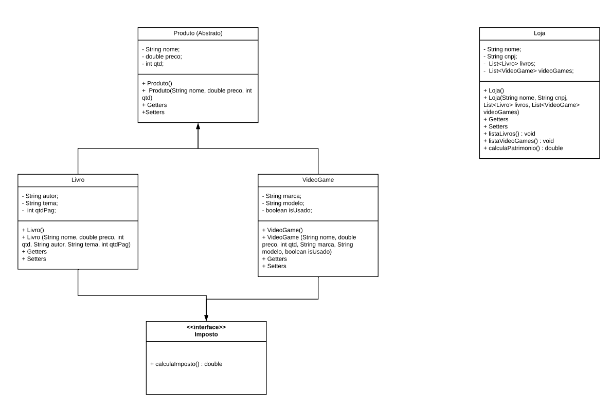

# Desafio TDD

Projeto para avaliação do módulo de TDD utilizando Junit5.

## Exercício 1 

Seguindo o diagrama UML a seguir, implemente a classe Veiculo e seus métodos. Após a implementação, testar cada um dos métodos via console.

- acelerar(): este método acrescenta um valor de 20 no atributo velocidade.
- abastecer(int combustivel): recebe como parâmetro uma quantidade de combustível e atribui a listrosCombustivel. OBS: O limite do tanque de combustível é de 60 litros, validar para não ultrapassar.
- frear(): a cada chamada do método diminui a velocidade em 20. Não aceitar a chamada do método se o veiculo estiver parado.
- pintar(String cor): recebe uma cor como parâmetro e altera o atributo.
- ligar(): Verifica se o veículo já se encontra ligado, caso não, liga o carro.
- desligar(): Verifica se o veículo já se encontra desligado, caso não, desliga o carro. Não permitir que desligue o veículo com (velocidade > 0)

## Exercício 2

Seguindo o diagrama UML a seguir, implemente as classes, interfaces e as saídas do programa. Após a implementação, testar cada um dos métodos via console.

## Exercício 3
Usando o conceito de polimorfismo, implemente o método lvlUp(), de forma que o Mago ao subir de nível possua um aumento maior nos
atributos Mana e Inteligência e o Guerreiro possua um aumento maior nos atributos Vida e Força.

Implemente o método attack() de forma que siga a seguinte regra:

- Mago 🧹 : ( Inteligência * Level ) + numeroRandomico( 0 até 300 ).

- Guerreiro ⚔: ( Força * Level ) + numeroRandomico( 0 até 300 ).

Exiba a quantidade de Personagens criados, utilize atributo static para implementar a solução.

## Exercício 7 
Considerando os conceitos de Orientação a Objetos, crie uma **classe Pai** de nome Funcionário com os seguintes atributos (nome, idade e salário) e mais três classes Filhas (Gerente, Supervisor e Vendedor). Na classe Funcionário deve existir um **método** de nome **bonificação** que retorna o salário, nas classes filhas deve existir o mesmo método bonificação porem com as seguintes regras:

- Para Gerente, o método bonificação deve retornar o salário + 10000.00;
- Para Supervisor, o método bonificação deve retornar o salário + 5000.00;

## Exercício Jogo de Tênis (Extra)
Neste problema você deverá implementar as regras de um jogo de tênis simples (apenas dois jogadores).

As regras de um jogo de tênis tem diversos detalhes, mas para simplificar o problema, você deve implementar apenas as regras de um game:

- Em uma game cada jogador pode ter a seguinte pontuação: 0, 15, 30, ou 40;

- Os jogadores sempre começam com 0 pontos;

- Se o jogador possui 40 pontos e ganha a disputa, ele vence o set;

- Se ambos jogadores atingem 40 pontos, ocorre um empate (deuce);

- Estando em empate, o jogador que ganhar a bola seguinte está em vantagem (advantage);

- Se um jogador em vantagem ganha novamente a bola, ele vence o set;

- Se um jogador estiver em vantagem e o outro ganhar a bola, volta a ocorrer o empata (deuce);

- Quando um jogador ganhar dois sets, ele vence e o jogo acaba.
(DojoPuzzles: https://dojopuzzles.com/problems/partida-de-tenis/)

